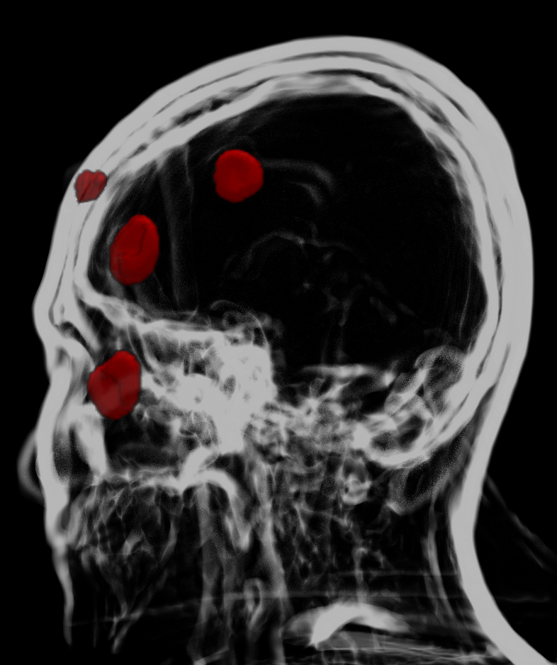

<!-- Improved compatibility of back to top link: See: https://github.com/othneildrew/Best-README-Template/pull/73 -->
<a id="readme-top"></a>
<!--
*** Thanks for checking out the Best-README-Template. If you have a suggestion
*** that would make this better, please fork the repo and create a pull request
*** or simply open an issue with the tag "enhancement".
*** Don't forget to give the project a star!
*** Thanks again! Now go create something AMAZING! :D
-->


<!-- PROJECT SHIELDS -->
<!--
*** I'm using markdown "reference style" links for readability.
*** Reference links are enclosed in brackets [ ] instead of parentheses ( ).
*** See the bottom of this document for the declaration of the reference variables
*** for contributors-url, forks-url, etc. This is an optional, concise syntax you may use.
*** https://www.markdownguide.org/basic-syntax/#reference-style-links
-->
[![Contributors][contributors-shield]][https://github.com/LawsOfForm][https://github.com/sriemannn]
[![Forks][forks-shield]][forks-url]
[![Stargazers][stars-shield]][stars-url]
[![Issues][issues-shield]][issues-url]
[![project_license][license-shield]][license-url]
[![LinkedIn][linkedin-shield]][linkedin-url]


<!-- PROJECT LOGO -->
<br />
<div align="center">
  <a href="https://github.com/LawsOfForm/Automated_Electrode_Coordinate_Extraction">
    
  </a>

<h3 align="center">Automated coordinate extraction from structural MRI data for intrascanner tDCS studies: A machine-learning approach</h3>

  <p align="center">
    project_description
    <br />
    <a href="https://github.com/LawsOfForm/Automated_Electrode_Coordinate_Extraction"><strong>Explore the docs »</strong></a>
    <br />
    <br />
    <a href="https://github.com/LawsOfForm/Automated_Electrode_Coordinate_Extraction">View Demo</a>
    &middot;
    <a href="https://github.com/LawsOfForm/Automated_Electrode_Coordinate_Extraction/issues/new?labels=bug&template=bug-report---.md">Report Bug</a>
    &middot;
    <a href="https://github.com/LawsOfForm/Automated_Electrode_Coordinate_Extraction/repo_name/issues/new?labels=enhancement&template=feature-request---.md">Request Feature</a>
  </p>
</div>


<!-- TABLE OF CONTENTS -->
<details>
  <summary>Table of Contents</summary>
  <ol>
    <li>
      <a href="#about-the-project">About The Project</a>
      <ul>
        <li><a href="#built-with">Built With</a></li>
      </ul>
    </li>
    <li>
      <a href="#getting-started">Getting Started</a>
      <ul>
        <li><a href="#prerequisites">Prerequisites</a></li>
        <li><a href="#installation">Installation</a></li>
        <li><a href="#preprocessing-data">Preprocessing data</a></li>
          <ul>
            <li><a href="#coregistration">Coregistration</a></li>
            <li><a href="#prepare-dataset">Prepare dataset</a></li>
          </ul>
      </ul>
    </li>
    <li><a href="#network">Network</a></li>
    <li><a href="#inference">Inference</a></li>
    <li><a href="#coordinate-extraction">Coordinate Extraction</a></li>
    <li><a href="#license">License</a></li>
    <li><a href="#contact">Contact</a></li>
    <li><a href="#acknowledgments">Acknowledgments</a></li>
  </ol>
</details>

<!-- ABOUT THE PROJECT -->
## About The Project

<!-- Built With -->
### built with

* [](https://www.python.org)
* [](https://monai.io)
* [](https://pytorch.org)
* [](https://www.mathworks.com/products/matlab.html)

<p align="right">(<a href="#readme-top">back to top</a>)</p>

<!-- GETTING STARTED -->
## Getting Started

This repository shares code to preprocess structural fMRI images (prefered PETRA-images (Pointwise Encoding Time Reduction with Radial Acquisition)). Segment high accurate electrodes by hand to train, test and validate an attention-unet. Use the final network to extract coordinates from your images and finally extract electrode coordinates. 

### Prerequisites

#### Software

You will need [python](https://www.python.org/), [matlab](https://www.mathworks.com/products/matlab.html) and [R](https://www.r-project.org/) (but you can write your own code in python to avoid matlab and R)
To create a virtual environment (recommended) use [mamba](https://mamba.readthedocs.io/en/latest/installation/mamba-installation.html).

For hand segmentation of electrodes use [3DSlicer](https://www.slicer.org/)

### Installation

#### Install CUDA (to use nvidia graphic card)

To install [CUDA](https://developer.nvidia.com/cuda-toolkit) on [Ubuntu](https://ubuntu.com/), follow these steps:
Step 1: Update and Upgrade Ubuntu
Run the following commands to ensure your system is up to date:

```sh
sudo apt update
sudo apt upgrade
```

Step 2: Install NVIDIA Drivers

Install the ubuntu-drivers-common package:

```sh
sudo apt install ubuntu-drivers-common
```

List available NVIDIA drivers:

```sh
sudo ubuntu-drivers devices
```

Install the recommended driver (e.g., nvidia-driver-535):

```sh
sudo apt install nvidia-driver-535
```

Reboot your system:

```sh
    sudo reboot now
```

Step 3: Verify Driver Installation
After rebooting, check if the NVIDIA driver is installed correctly:

```sh
nvidia-smi
```

This should display information about your GPU and driver version.
Step 4: Install CUDA Toolkit

Download and install the CUDA keyring:

```sh
wget https://developer.download.nvidia.com/compute/cuda/repos/ubuntu2204/x86_64/cuda-keyring_1.1-1_all.deb
sudo dpkg -i cuda-keyring_1.1-1_all.deb
sudo apt-get update
```

Install the CUDA toolkit:

```sh
sudo apt-get -y install cuda
```

Reboot your system again:

```sh
    sudo reboot now
```

Step 5: Set Up Environment Variables
Add CUDA paths to your .bashrc file:

```sh
echo 'export PATH=/usr/local/cuda/bin${PATH:+:${PATH}}' >> ~/.bashrc
echo 'export LD_LIBRARY_PATH=/usr/local/cuda/lib64${LD_LIBRARY_PATH:+:${LD_LIBRARY_PATH}}' >> ~/.bashrc
source ~/.bashrc
```

Step 6: Verify CUDA Installation
Check if CUDA is installed successfully by running:

```sh
nvcc -V
```

This should display the CUDA version.

#### Create Virtual environment

To install Mamba on Ubuntu, follow these steps:

Open a terminal window.
Download the Mambaforge installer script using wget:

```sh
wget https://github.com/conda-forge/miniforge/releases/latest/download/Mambaforge-Linux-x86_64.sh
```

Make the installer script executable:

```sh
chmod +x Mambaforge-Linux-x86_64.sh
```

Run the installer:

```sh
bash Mambaforge-Linux-x86_64.sh
```

Follow the prompts during installation. When asked to initialize Mamba, type 'yes'2.
Close the terminal and open a new one to apply the changes.
Verify the installation by running:

```sh
mamba --version
```

After installation, you can use Mamba to create environments and install packages. To create a new environment with the given *network.yml*, change directory to :

```sh
  (base)$ cd 'path/to/repository/'
```

create new virtual environment named 'network'

```sh
(base)$ mamba env create -f network.yml
```

Activate the virtual environment

```sh
(base)$ mamba activate network
```

If successfully installed, the 'base' environment should change to 'network' in your terminal any should be able to run the model.

```sh
(network)$ python3 model.py
```

## Preprocessing data

### Coregistration

In our case we run electric field map simulations to find optimal electrode positions, so we had baseline coordinates which we like to compare against other sessions. Therefore we coregistrated all other sessions to a baseline session. If you don't have baseline sessions, you can ignore the the coregistration.

Use the *Coregistration.m* script in the *code/Preprocess/01_coregistration* 
It's used for searching a bids format and extracting all petra images of interest and generate a new dataset which can be used as *dataset* folder in the repository.

```sh
matalb Coregistrat.m
```

### Prepare dataset

Open [3DSlicer](https://www.slicer.org/) in terminal

```bash
Slicer
```

#### Dataset

Dataset has to look something like this *Repository/Dataset/dataset/..../sub-xx/unzipped/*. You can change the structure as you like but you have to adjust the path in some scripts

#### Files

If you have baseline sessions __use coregistrated images__ to later correct electrode naming more easily

In matlab coregistrated images named like this *rsub-xx_ses-x_acq-petra_run-0x_PDw.nii*

#### Process of segmenting electrodes

##### overall procedure

1) create a segment
2) Get optimal visual of electrode
   * Choose one electrode
   * Align the electrod in the middle
     * Crosshair of AS and LS should perfectly be plane to electrode surface
     * To achieve that rotate the SPR and AS images via "Transforms" module

3) Add circular segment over gel and electrode plug
    * Choose another electrode and add segement
    * Export segmented electrodes

* Save between steps to avoid data loss when the program crashes
* save project data in folder named like *sub-0xx_ses-x_run-x*
* check everytime IF THE FOLDERNAME AND PATH IS CORRECT, otherwise data will be overwriten and lost

##### Step by step

##### Adjust View

* change View in the menu bar
  *View -> Layout -> Four-Up*
  * you should see now a 2x2 window in wich on the 
  * upper left: SPR (Horizontal) plane is displayed in red
  * upper right: 3D image of the head is shown (feature must be activated)
  * bottom left: AS (Coronal) plane in green
  * bottom right: LS (Saggital) plane in yellow
* Link the slice views by clicking on the 2 rings in each window
*- Rings have to appear closed
*- Zomm in and Out: STRG + mouse wheel

##### Switching slider menu on the left of the image

* Adding segments, grouping segments and images etc. can be done with __MODULES__.
* All available modules are in listed in the slide menu next to "Modules:" Icon on the top left next to "Data", "DCN" and "SAVE" Icon
* This is called in the text the *Modules: slide bar*
* Choose the module you need like *Segment Editor* or *Transforms* or *Views*
* Click on the module to open it
* On the left of the 3D images you will no find the *module menu*
* In further instruction we will refer to *Modules: slide bar* and *module menu* to not get confused

##### 1) Add Segments

###### Modules: slide bar

* Choose on the slide bar *Segmentation Editor* to open the editor menu

###### Module menu

* Go to "Add" and add 4 segments

###### 2) Apply Transforms

##### Modules: slide bar

* Choose on the slide bar *Transforms* to open the menu opportunities
* On the menu bar on the left are now all options for image transformations we like to apply

#### Module menu

* Go to *Active Transform:* and choose the the slide bar *Linear transforms*
* Before you start the transformations go to *Apply transform* 
* Select the "Segment" and the "loaded image" to process transformation on both simultanously
* Use the Translation and Rotation bars to put the electrode in the middle and to align them to the crosshair of one dimension
* example:
  * the crosshair in each image has a vertical and horizontal line
  * in the slice the electrode gel forms also a line
  * the line of the gel shoul be parallel with the horizontal line in exact 2 images
  * the SPR image and the AS image (see image descripitions above the slide bars of the images
  * if the lines are parallel in both images in the LS image the gel shoul appear nearly as perfect circle
  * scroll to the outmost point from which a clear circular shape is detectable
  * start segmenting the electrode with a painter that is circular (details in the next step)
__Tips__

* if you place the mous on one point of the imag an then press shift for a wile the crosshair of all images will be centered to that point
* so if you target a new electrode and you found it. Place the mouse on it and press shift for a while

#### 3) Segment the electrode

#### Modules: slide bar

* Choose on the slide bar *Segmentation Editor* to open the editor menu 

####  module menu

* Click on the segment you want to create (exmaple named Segment_1)
* Click on the paint icon to get a circular painter
* Increase or decrease the radius of the painter: shift+mouse whell
* The radius should perfectly match the radius of the electrode or gel
* If the circular painter is exctly matching the boundaries of the gel, click to segment the first slide
* use the mouse wheel in the LS window to get to the next slide
* Use the *Show 3D* button 
* If the gel and the electrode are fully covered go to the next electrode

* at the end of all segmentations use the smooting option to smooth the segments
* and the *Fill between slices* to fill between the segments

* _Export_ Segments as *.nii file
* click on the little sidebar next to the green error (in the same line in which you Add and Remove segments)
* click *Export to files*
* make sure to choose the correct folder and click *Export*
* You should now see a file called __Segmentation.nii__
__Tips__

* if the electrode is deformed or the gel is spread to more tissue then normally, decrease the radius of the painter to get those areas too and use the erase to erase uncorrect segmentet areas

* if the painter is not drawing sometimes in the menu below the point "Editable area:" is not set to everywhere an therefore the painter can not draw everywhere

#### Create dataset for network

Use codes in the *repository/code/Preprocess/02_prepare_dataset* to create a *dataset.tar.gz* file which later can also be used for traning of the network on a cluster.

1) unite the 4 segmented electrodes into 3 mask with the *01_unite_mask.py* script.
Therefore change in the script 

```sh
network$ python3 unite_mask.py
```

2) create dataset in which subject and mask are structured for network input

```sh
network$ python3 create_dataset.py
```

the *dataset.tar.gz* will be saved in the *02_prepare_dataset* folder. Merg or unzip the tarfile into the */repository/dataset* folder.

## Network

All relevant code in in the *repository/code/Network* folder. If you want to redirect the path to your dataset, change the __root_dataset__ variable at the beginning of the script.
Be aware that the *create_dataset* script creates the dataset as if they were in your source folder, so you have to change the path to your subject folders. In general, check your dataset folder structure and replace the *dataset/media/MeMoSLAP_Subjects/derivatives/automated_electrode_extraction* path line with your dataset structure.

Change directory

```sh
(base)$ cd repository/code/Network
```

Before running the code activate the virtual environment. 

```sh
(base)$ mamba activate network
```

Run the code

```sh
(network)$ python3 model.py
```

## Inference

After each training session a test dice metric is displayed at the terminal. The model with the best dice metric will automatically safed. If you want to safe this model copy and paste it in the *models* folder and rename it.
You can use the model for inference. Therefore go to the inference folder */repository/code/Inference*

Befor you start change the __root_images__ and __model__ variable at the top of the script.

```sh
(base)$ cd repository/code/Inference
```

If not already done active the virtual environment

```sh
(base)$ mamba activate network
```

Run the code

```sh
(network)$ python3 Inference.py
```

To overwrite already segmented images use

```sh
(network)$ python3 Inference.py --overwrite
```

## Coordinate Extraction

After the inference ist done, extract the coordinates from the infered images.
Use the *01_Extract_coordinates.py* script in the */repository/code/Extract_Coordinates* Folder.

```sh
(base)$ cd repository/code/Extract_Coordinates
```

If not already done active the virtual environment

```sh
(base)$ mamba activate network
```

Run the code

```sh
(network)$ python3 01_Extract_coordinate.py
```

Electrodes of each subject, session and run are in the */repository/code/Extract_Coordinates/Table folder*

### If you have baseline electrode coordinates, correct electrode naming can be implied

In */repository/code/Extract_Coordinates/Table* folder you will find a file called *DF_2Methods_2Raters_All_Coord.csv*. This file contains the electrode coordinates and the electrode names of all session including baseline. 
If you have baseline electrode coordinates, you can correct the electrode naming by using the *02_Merge_tables.py* and the *03_Correct_Electrode_Coordinates.py* script. The code is highly dependent on the DF_2Methods_2Raters_All_Coord.csv file. Therefore, make sure to have a similar file before you start.

Merge both tsv files

```sh
(network)$ python3 02_Merge_tables.py
```

Fits electrode naming to the baseline naming. For example, if the baseline electrode name is "Anode" with coordinates (x,y,z) and the infered subject electrode name is "Cathode1" with similar coordinates, the subject electrode name will be changed to "Anode" and coordinates will be also switched.

```sh
(network)$ python3 03_Correct_Electrode_Coordinates.py
```

<!-- CONTRIBUTING -->
## Contributing

Contributions are what make the open source community such an amazing place to learn, inspire, and create. Any contributions you make are **greatly appreciated**.

If you have a suggestion that would make this better, please fork the repo and create a pull request. You can also simply open an issue with the tag "enhancement".
Don't forget to give the project a star! Thanks again!

1. Fork the Project
2. Create your Feature Branch (`git checkout -b feature/AmazingFeature`)
3. Commit your Changes (`git commit -m 'Add some AmazingFeature'`)
4. Push to the Branch (`git push origin feature/AmazingFeature`)
5. Open a Pull Request

<p align="right">(<a href="#readme-top">back to top</a>)</p>

### Top contributors:

<a href="https://github.com/github_username/repo_name/graphs/contributors">
  
</a>


<!-- LICENSE -->
## License

Distributed under the project_license. See `LICENSE.txt` for more information.

<p align="right">(<a href="#readme-top">back to top</a>)</p>

<!-- CONTACT -->
## Contact

Filip Niemann filipniemann@gmail.com
Steffen Riemann 

Project Link: [https://github.com/LawsOfForm/Automated_Electrode_Coordinate_Extraction.git](https://github.com/LawsOfForm/Automated_Electrode_Coordinate_Extraction.git)

<p align="right">(<a href="#readme-top">back to top</a>)</p>

<!-- ACKNOWLEDGMENTS -->
## Acknowledgments

* []()
* []()
* []()

<p align="right">(<a href="#readme-top">back to top</a>)</p>


<!-- MARKDOWN LINKS & IMAGES -->
<!-- https://www.markdownguide.org/basic-syntax/#reference-style-links -->
[contributors-shield]: https://img.shields.io/github/contributors/github_username/repo_name.svg?style=for-the-badge
[contributors-url]: https://github.com/github_username/repo_name/graphs/contributors
[forks-shield]: https://img.shields.io/github/forks/github_username/repo_name.svg?style=for-the-badge
[forks-url]: https://github.com/github_username/repo_name/network/members
[stars-shield]: https://img.shields.io/github/stars/github_username/repo_name.svg?style=for-the-badge
[stars-url]: https://github.com/github_username/repo_name/stargazers
[issues-shield]: https://img.shields.io/github/issues/github_username/repo_name.svg?style=for-the-badge
[issues-url]: https://github.com/github_username/repo_name/issues
[license-shield]: https://img.shields.io/github/license/github_username/repo_name.svg?style=for-the-badge
[license-url]: https://github.com/github_username/repo_name/blob/master/LICENSE.txt
[linkedin-shield]: https://img.shields.io/badge/-LinkedIn-black.svg?style=for-the-badge&logo=linkedin&colorB=555
[linkedin-url]: https://linkedin.com/in/linkedin_username
[product-screenshot]: images/screenshot.png
[Next.js]: https://img.shields.io/badge/next.js-000000?style=for-the-badge&logo=nextdotjs&logoColor=white
[Next-url]: https://nextjs.org/
[React.js]: https://img.shields.io/badge/React-20232A?style=for-the-badge&logo=react&logoColor=61DAFB
[React-url]: https://reactjs.org/
[Vue.js]: https://img.shields.io/badge/Vue.js-35495E?style=for-the-badge&logo=vuedotjs&logoColor=4FC08D
[Vue-url]: https://vuejs.org/
[Angular.io]: https://img.shields.io/badge/Angular-DD0031?style=for-the-badge&logo=angular&logoColor=white
[Angular-url]: https://angular.io/
[Svelte.dev]: https://img.shields.io/badge/Svelte-4A4A55?style=for-the-badge&logo=svelte&logoColor=FF3E00
[Svelte-url]: https://svelte.dev/
[Laravel.com]: https://img.shields.io/badge/Laravel-FF2D20?style=for-the-badge&logo=laravel&logoColor=white
[Laravel-url]: https://laravel.com
[Bootstrap.com]: https://img.shields.io/badge/Bootstrap-563D7C?style=for-the-badge&logo=bootstrap&logoColor=white
[Bootstrap-url]: https://getbootstrap.com
[JQuery.com]: https://img.shields.io/badge/jQuery-0769AD?style=for-the-badge&logo=jquery&logoColor=white
[JQuery-url]: https://jquery.com 
