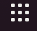
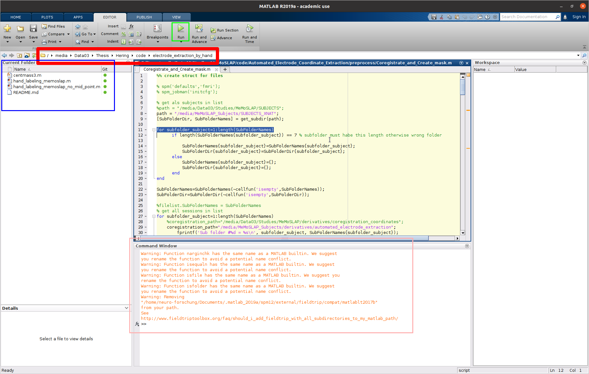

# Electrode extraction by hand: "Pancake Method"

## Tabel of Contents
1. [Matlab](#matlab)
2. [Python](#python)</br>
    2.1. [Adjustments](#adjustments)

## Matlab 

1. open Matlab 2019 </br>
    ... by typing `matlab_2019` into the terminal 
    
    or 
    
    ... by using matlab icon in the application launcher: 

    1. open the application launcher:

        

    2. click on the matlab icon:

        

    The scripts will only work with Matlab 2019 and not with other Matlab versions installed on this machine. If you are not sure which version is open just type `version` in the Command Window (pink box in the image below) and press `Enter` 

2. When matlab is open select the correct path to your working directory. I.e., the path to your Thesis directory (either [/media/Data03/Thesis/Dabelstein/code/electrode_extraction_by_hand](/media/Data03/Thesis/Dabelstein/code/electrode_extraction_by_hand) or [/media/Data03/Thesis/Hering/code/electrode_extraction_by_hand](/media/Data03/Thesis/Hering/code/electrode_extraction_by_hand)). This path should shown in the matlab window (red box image below)

    

3. If you correctly adjusted the path, you should see the `hand_labeling_memoslap_no_mid_point.m` script on the left side under **Current Folder** (blue box). Open this script by double clicking it.

4. Adjust the first lines of the matlab script

    ```matlab
    sub_to_analyse = 'sub-010'; %insert here
    session = 1; % and here
    run = 1; % and here
    ```
    These are the only lines you have to adjust.

5. Run the script by pressing **Run** (green box) or pressing `F5`. This will run the script and after a pancake view of a structural brain scan will pop-up. Here every electrode is extracted with 6 points near the rim of the electrode. Be careful to place the points on the electrode, as the placement of the electrode otherwise will be off. The first electrode you mark has always to be the anode, i.e., the electrode in the middle of the montage. The other electrodes do not have to be extracted in a specific order. </br> </br> If you missplace any point, just close the window and run the script again. This will also delete all previously made markings. When you marked all electrodes just close the window with the pancake view. The script will continue to run and output some coordinates in the command window (pink box).

<!-- TODO: add link to local image of the pancake view so that no participant data is uploaded to github -->

6. Control the outputs of the script in the derivatives directory (either [/media/Data03/Thesis/Dabelstein/derivatives/automated_electrode_extraction](/media/Data03/Thesis/Dabelstein/derivatives/automated_electrode_extraction) or [/media/Data03/Thesis/Hering/derivatives/automated_electrode_extraction](/media/Data03/Thesis/Hering/derivatives/automated_electrode_extraction)) </br></br> According to the subject info you provided to the matlab script directories are created with the subject-id, session, and run. The bottom directory should be populated with the files shown below in the file tree. If you also processed the other MRI data of the subjects for all processed sessions and runs the same files should be available.

```file-tree
sub-010/
┗ electrode_extraction/
┃ ┣ ses-1/
┃ ┃ ┣ run-01/
┃ ┃ ┃ ┣ finalmask.nii.gz
┃ ┃ ┃ ┣ handextracted_electrode_pos.csv
┃ ┃ ┃ ┣ idqs.nii.gz
┃ ┃ ┃ ┣ layers.nii.gz
┃ ┃ ┃ ┣ layers_binarized.nii.gz
┃ ┃ ┃ ┣ maskvq.nii.gz
┃ ┃ ┃ ┣ mricoords_1.mat
┃ ┃ ┃ ┣ mricoords_10.mat
┃ ┃ ┃ ┣ mricoords_11.mat
┃ ┃ ┃ ┣ mricoords_12.mat
┃ ┃ ┃ ┣ mricoords_13.mat
┃ ┃ ┃ ┣ mricoords_14.mat
┃ ┃ ┃ ┣ mricoords_15.mat
┃ ┃ ┃ ┣ mricoords_16.mat
┃ ┃ ┃ ┣ mricoords_17.mat
┃ ┃ ┃ ┣ mricoords_18.mat
┃ ┃ ┃ ┣ mricoords_19.mat
┃ ┃ ┃ ┣ mricoords_2.mat
┃ ┃ ┃ ┣ mricoords_20.mat
┃ ┃ ┃ ┣ mricoords_21.mat
┃ ┃ ┃ ┣ mricoords_22.mat
┃ ┃ ┃ ┣ mricoords_23.mat
┃ ┃ ┃ ┣ mricoords_24.mat
┃ ┃ ┃ ┣ mricoords_25.mat
┃ ┃ ┃ ┣ mricoords_26.mat
┃ ┃ ┃ ┣ mricoords_27.mat
┃ ┃ ┃ ┣ mricoords_28.mat
┃ ┃ ┃ ┣ mricoords_29.mat
┃ ┃ ┃ ┣ mricoords_3.mat
┃ ┃ ┃ ┣ mricoords_30.mat
┃ ┃ ┃ ┣ mricoords_4.mat
┃ ┃ ┃ ┣ mricoords_5.mat
┃ ┃ ┃ ┣ mricoords_6.mat
┃ ┃ ┃ ┣ mricoords_7.mat
┃ ┃ ┃ ┣ mricoords_8.mat
┃ ┃ ┃ ┣ mricoords_9.mat
┃ ┃ ┃ ┣ petra_.nii.gz
┃ ┃ ┃ ┣ petra_masked.nii.gz
┃ ┃ ┃ ┗ rgbs.png
┃ ┃ ┗ run-02/
...
┃ ┣ ses-2/
┃ ┃ ┗ run-01/
...
┃ ┣ ses-3/
┃ ┃ ┗ run-01/
...
┃ ┗ ses-4/
┃   ┗ run-01/
...
```

## Python

The python scripts in the cylinder-roi directory (either [/media/Data03/Thesis/Dabelstein/code/cylinder_roi](/media/Data03/Thesis/Dabelstein/code/cylinder_roi) or [/media/Data03/Thesis/Hering/code/cylinder_roi](/media/Data03/Thesis/Hering/code/cylinder_roi)) allow you to check how precise your electrode placement was.

The main reason to run these commands is to get the centre of the extracted electrode and to get a visual report to control the electrode placement.

1. Open a terminal in the cylinder-roi directory (right click anywhere in the directory and select `Open in terminal`)

2. The packages to run the python scripts are installed into a virtual environment. If this environment is not active, you will not be able to run the scripts. Activate the virtual environment with the following command and execute the command by pressing **Enter**.

    ```bash
    conda activate electrode_extraction
    ```

3. run the `create_cylinder.py` script. This script will a electrode shaped region of interest using the coordinates extracted with the matlab script. You can run the script by writing the following command in the terminal and pressing **Enter**:

    ```bash
    python create_cylinder.py
    ```

    This script will also create a textfile called `mid.txt`. This textfile centres of the electrodes in the format (electrodes x dimensions) (rows x columns), i.e., the first row contains the x,y,z coordinate of the first electrode. The coordinate dimensions are separated by commas, thus this format is called comma separated values (csv).


4. After this command, run the `mask_separation.py` script. This should create a single nifti image for every electrode extracted. However, this script will take some time to run:

    ```bash
    python mask_separation.py
    ```

5. Finally, run `report.py`:

    ```bash
    python report.py
    ```

    This script will create a `reports` directory in you code directory (either [/media/Data03/Thesis/Dabelstein/code/cylinder_roi](/media/Data03/Thesis/Dabelstein/code/cylinder_roi) or [/media/Data03/Thesis/Hering/code/cylinder_roi](/media/Data03/Thesis/Hering/code/cylinder_roi)). The script will create an image for every processed subject with the naming scheme `sub-<id>_ses-<num>_run-<num>.png`. This image shows the subjects structural image overlayed with the segmented electrodes created by the `mask_separation.py` script. This allows to check the precision of the electrode extraction, i.e., if the electrode, which can be seen in the structural image, is enclosed by extracted electrode and if the real and the extracted electrode have similar tilt.

### Adjustments

Some adjustments can be made to make the python scripts run faster

#### `create_cylinder.py`

The script `create_cylinder.py` can be adjusted to only run if the electrodes are newly extracted by opening the script with a text editor and delete the `#` signs in front of these lines:

before:

```python
# if op.exists(cylinder_mask_path) and op.exists(cylinder_mask_plus_plug):
#    continue
```

after:

```python
if op.exists(cylinder_mask_path) and op.exists(cylinder_mask_plus_plug):
    continue
```

This checks in the output directory `cylinder_ROI.nii.gz` and `cylinder_plus_plug_ROI.nii.gz` exists. The script is not run for subjects, if these files exists. This will make the execution of the script much faster.

#### `mask_separation.py`

TODO

#### `report.py`

TODO